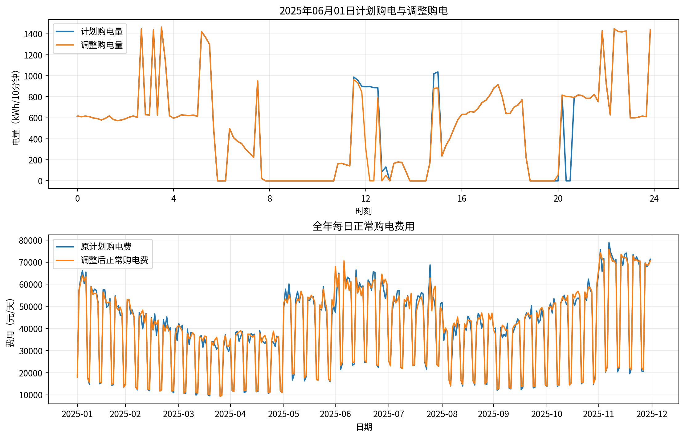
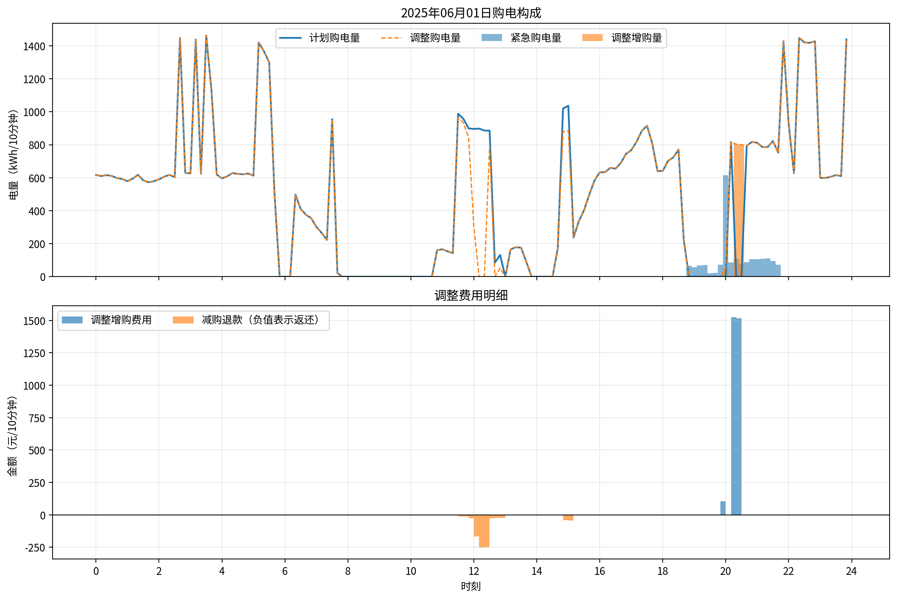
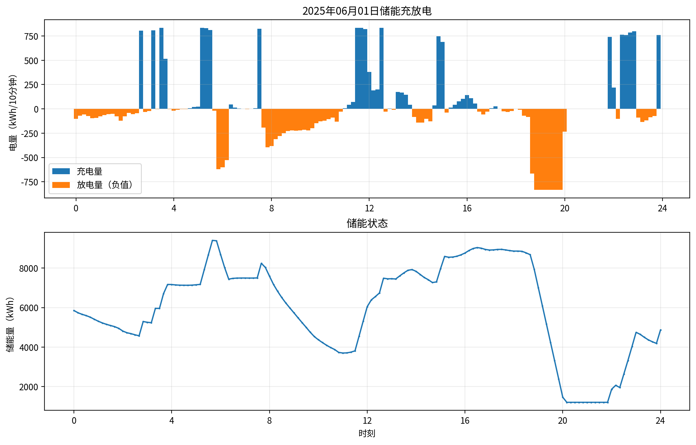
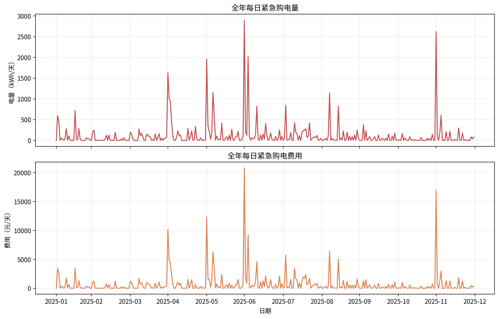

# 问题4-3：基于类别切换负荷预测和实时储能反馈的日内滚动购电优化模型

本文对应问题四条件下重新求解第三问，即问题4-3。公式、参数和结果以本目录的冻结参数、正式结果及上级目录 `dispatch_core.py` 当前实现为准。

## 1. 问题描述与时间离散

将每天划分为144个十分钟时段，日期记为 $d$，时段记为 $t=0,1,\ldots,143$，时段长度为

$$
\Delta t=\frac16\ \mathrm{h}.
$$

附件2的负荷和光伏功率乘以 $\Delta t$ 后转换为电量。主要符号如下。

| 符号 | 含义 |
| --- | --- |
| $L_{d,t},P_{d,t}$ | 实际负荷电量、实际光伏电量 |
| $p_{d,t}$ | 附件4给出的日期 $d$、交付时段 $t$ 的电价 |
| $q^0_{d,t}$ | 当天00:00制定的原始正常购电计划 |
| $q_{d,t}$ | 滚动调整后最终采用的正常购电计划 |
| $u_{d,t},v_{d,t}$ | 相对原始计划的最终增购量、取消量 |
| $\pi_{d,t}$ | 最后一次被采纳的、覆盖时段 $t$ 的调整交易价格 |
| $e_{d,t}$ | 实时紧急购电量 |
| $c_{d,t},D_{d,t},w_{d,t}$ | 实际充电量、放电量、弃电量 |
| $S_{d,t}$ | 时段开始时的储能量，单位kWh |

问题4-3使用附件4逐日电价，不再使用问题三中每天重复的单日电价曲线。当天调度使用当天完整的144点电价曲线，不另建价格预测模型。

储能参数为

$$
\eta_c=\eta_d=0.9,\qquad S_{\min}=1200,\qquad S_{\max}=10800,
$$

$$
0\le c_{d,t},D_{d,t}\le E_{\max}=5000\Delta t=\frac{5000}{6}\ \mathrm{kWh}.
$$

1月1日初始储能为6000 kWh，之后按实际运行状态连续传递：

$$
S_{d+1,0}=S_{d,144}.
$$

## 2. 因果负荷预测

日期 $d$ 的负荷预测仅使用日期 $k<d$ 的实际负荷。记日总负荷为

$$
B_d=\sum_{t=0}^{143}L_{d,t}.
$$

在2025年1月15日00:00，仅使用1月1—14日数据计算七个星期类别的平均日总负荷，取均值最低的两个星期类别组成低负荷集合 $\mathcal W_L$，此后冻结。本数据识别结果为星期五和星期六。冻结前暂将星期六、星期日归为低负荷类。定义二元类别

$$
k_d=\mathbf 1\{\operatorname{weekday}(d)\notin\mathcal W_L\}.
$$

当天形状取最近三个同类别历史日集合 $\mathcal I_d$：

$$
s_{d,t}=\frac{\sum_{i\in\mathcal I_d}L_{i,t}}{\sum_{i\in\mathcal I_d}B_i},
\qquad \sum_t s_{d,t}=1.
$$

再从此前最多35天内发生类别切换的日期集合 $\mathcal J_d$ 估计切换系数：

$$
\gamma_d=\operatorname{median}_{i\in\mathcal J_d}
\frac{\log(B_i/B_{i-1})}{k_i-k_{i-1}}.
$$

没有切换样本时取 $\gamma_d=0$。当天总量和逐时段预测为

$$
\widehat B_d=B_{d-1}\exp[\gamma_d(k_d-k_{d-1})],\qquad
\widehat L_{d,t}=\max(0,\widehat B_d s_{d,t}).
$$

若没有同类历史日则回退到前一日。1月1日仍使用附件1的冷启动曲线。当天各次光伏预报更新共用00:00时已经确定的负荷预测，不使用当天未来负荷。正式评价期负荷预测MAE为22.535020 kWh/10分钟。

## 3. 光伏预报的时间映射和插值

光伏预报在每天 $h\in\{0,6,12,18\}$ 时发布。附件3的“预报1小时”对应 $h+1$ 时刻，以此类推。

在发布时间补入一个最近已观测功率节点 $F_0^{(h)}$：

- $h=0$ 时，使用前一天最后一个十分钟光伏功率；1月1日取0；
- $h>0$ 时，使用当天发布时间前一个十分钟的实际光伏功率。

与24个预报节点组成 $F_0^{(h)},F_1^{(h)},\ldots,F_{24}^{(h)}$，采用分段线性插值：

$$
f^{(h)}(j+\lambda)=(1-\lambda)F_j^{(h)}+\lambda F_{j+1}^{(h)},
\qquad 0\le\lambda\le1.
$$

令 $s_h=6h$，对 $t\ge s_h$，取 $x_t=(t-s_h)/6$，预测光伏电量为

$$
\widehat P_{d,t}^{(h)}=\left[\frac{\Delta t}{2}
\left(f^{(h)}(x_t)+f^{(h)}(x_{t+1})\right)\right]_+.
$$

新预报只用于发布时间之后的剩余时段；超过当天24:00的预测不进入当前单日LP。

## 4. 净负荷预测和安全裕度

预测净负荷及历史误差分别为

$$
\widehat N_{d,t}^{(h)}=\widehat L_{d,t}-\widehat P_{d,t}^{(h)},
$$

$$
\varepsilon_{k,t}^{(h)}=L_{k,t}-P_{k,t}-\widehat N_{k,t}^{(h)}.
$$

设安全裕度的历史样本集合为 $\mathcal E_d$，则

$$
b_{d,t}^{(h)}=\left[Q_\beta\left(\{\varepsilon_{k,t}^{(h)}:k\in\mathcal E_d\}\right)\right]_+.
$$

样本选择优先使用此前28天内的同类型日；不足7天时扩展至全部此前同类型日；仍不足时使用此前全部日期。无历史样本时裕度为0。

正式阶段冻结 $\beta=0.6$。计算完当天各发布时间的裕度后，才将当天误差加入历史池，避免使用当天未来的实际负荷和光伏。更换负荷预测后，四个发布时间的历史净负荷误差和安全裕度均由新预测重新计算。

## 5. 每日00:00原始购电计划

日前LP变量为 $q_t^0,\widetilde e_t,\widetilde c_t,\widetilde D_t,\widetilde w_t,\widetilde S_t,z$。波浪号表示规划量，实际执行量由实时反馈产生。省略固定日期下标 $d$，目标为

$$
\min\ \sum_{t=0}^{143}p_{d,t}(q_t^0+5\widetilde e_t)+\rho z.
$$

供需平衡和储能转移满足

$$
q_t^0+\widetilde e_t+\widetilde D_t-\widetilde c_t-\widetilde w_t
=\widehat N_{d,t}^{(0)}+b_{d,t}^{(0)},
$$

$$
\widetilde S_{t+1}=\widetilde S_t+0.9\widetilde c_t-\frac{\widetilde D_t}{0.9}.
$$

约束为

$$
1200\le\widetilde S_t\le10800,\qquad
0\le\widetilde c_t,\widetilde D_t\le\frac{5000}{6},
$$

$$
q_t^0,\widetilde w_t\ge0,\qquad \widetilde e_t=0,\qquad
\widetilde S_0=S_{d,0}^{\mathrm{actual}},
$$

$$
\widetilde S_{144}+z\ge S^\star,\qquad 0\le z\le9600.
$$

问题4-3当前冻结的终端目标为

$$
S^\star=6000\ \mathrm{kWh},\qquad \rho=\bar p\approx0.7661976046\ \mathrm{元/kWh}.
$$

**当前程序的 $\bar p$ 是附件4全年365天、每天144点电价的算术平均值，并非每天单独计算的均价：**

$$
\bar p=\frac{1}{365\times144}\sum_{d=1}^{365}\sum_{t=0}^{143}p_{d,t}.
$$

终端目标是软约束，不要求实际日末SOC严格等于6000 kWh。若第一阶段LP解存在同时充放电，程序进一步最小化规划充放电总量，并将主目标限制在数值容差内，以减少退化解中的同时充放电。

## 6. 日内滚动购电调整

在06:00、12:00、18:00，以实时SOC作为新LP初始状态，更新剩余时段 $\mathcal T_h=\{s_h,\ldots,143\}$ 的计划。

调整账本约束为

$$
q_t=q_t^0+u_t-v_t,\qquad u_t\ge0,\qquad 0\le v_t\le q_t^0,\qquad q_t\ge0.
$$

定义本轮交易价格 $\tau_{d,h}=p_{d,s_h}$。问题4-3当前实现将本轮剩余时段的增购、取消按此交易时刻价格估价，紧急购电按交付时段价格估价：

$$
\min\ \sum_{t\in\mathcal T_h}
\left(1.5\tau_{d,h}u_t-0.5\tau_{d,h}v_t+5p_{d,t}\widetilde e_t\right)+\rho z.
$$

供需平衡为

$$
q_t+\widetilde e_t+\widetilde D_t-\widetilde c_t-\widetilde w_t
=\widehat N_{d,t}^{(h)}+b_{d,t}^{(h)}.
$$

储能转移、边界和终端软约束与日前LP一致，但初始状态改为 $\widetilde S_{s_h}=S_{d,s_h}^{\mathrm{actual}}$。

每轮求解两个候选：

1. 不调整候选：$q_t$ 固定为当前计划，允许 $\widetilde e_t\ge0$；
2. 自由调整候选：允许重新选择 $q_t$，固定 $\widetilde e_t=0$。

仅当

$$
F_h^{\mathrm{fixed}}-F_h^{\mathrm{free}}>10^{-7}
$$

时采纳新计划。注意这里是“大于”，表示新候选目标值更低。

采纳后更新剩余计划，并对全部 $t\in\mathcal T_h$ 更新 $\pi_{d,t}=\tau_{d,h}$；未采纳时保留原计划和此前记录的价格。当天开始时 $\pi_{d,t}=0$，未发生调整的时段最终 $u_{d,t}=v_{d,t}=0$。已经执行的时段不再改变，原始计划 $q^0$ 始终保存。

**实现边界：** 当前不调整候选也使用本轮交易价格计算其净调整费用，而最终结算会保留此前生效的价格。因此该候选比较是当前算法的决策规则，不能据此证明每一次采纳都必然降低最终实际账单。本文描述现有结果对应的实现，没有将尚未实施的改进写入模型。

## 7. 实时储能反馈控制

实际运行不强制执行LP规划的充放电轨迹。每个时段依据当前负荷、光伏、正常购电计划和SOC计算

$$
r_{d,t}=L_{d,t}-P_{d,t}-q_{d,t}.
$$

当 $r_{d,t}>0$ 时，优先放电，剩余缺口紧急购电：

$$
D_{d,t}=\min\left\{r_{d,t},\frac{5000}{6},0.9[S_{d,t}-1200]_+\right\},
$$

$$
e_{d,t}=[r_{d,t}-D_{d,t}]_+,\qquad c_{d,t}=w_{d,t}=0.
$$

当 $r_{d,t}\le0$ 时，优先充电，剩余富余弃用：

$$
c_{d,t}=\min\left\{-r_{d,t},\frac{5000}{6},\frac{10800-S_{d,t}}{0.9}\right\},
$$

$$
w_{d,t}=[-r_{d,t}-c_{d,t}]_+,\qquad D_{d,t}=e_{d,t}=0.
$$

实际SOC更新为

$$
S_{d,t+1}=S_{d,t}+0.9c_{d,t}-\frac{D_{d,t}}{0.9}.
$$

当前反馈规则的保留SOC固定为1200 kWh，没有加入按后续电价动态保留电量的策略。当前时段使用实时观测，未来负荷和光伏仍使用预测。

## 8. 参数冻结和运行阶段

### 8.1 1月1—7日：启动预热

使用 $\beta_{\mathrm{start}}=0.7$、$S^\star_{\mathrm{start}}=6000$ kWh、$\rho_{\mathrm{start}}=\bar p$，建立历史误差池并连续传递SOC。

### 8.2 1月8—31日：参数校准

使用有限网格

$$
\beta\in\{0.5,0.6,0.7,0.8,0.9\},\qquad
S^\star\in\{4800,6000,7200\},\qquad
\rho/\bar p\in\{0,1,2\}.
$$

各候选从相同预热终态开始，对1月8—31日回放，以

$$
J_{\mathrm{cal}}=J_{\mathrm{Jan\,8\text{--}31}}-0.9\bar p S_{\mathrm{end}}
$$

最小为选择标准。重新校准后的 `frozen_parameters.json` 保存

$$
\beta=0.6,\qquad S^\star=6000\ \mathrm{kWh},\qquad \rho/\bar p=1.0.
$$

参数只使用1月8—31日选择，2—12月结果没有参与筛选。

### 8.3 2月1日—12月31日：正式评价

评价期共334天，冻结参数不再根据评价期费用重新选择；历史误差池仍按日期顺序更新。A/B/C从同一1月末SOC开始：

$$
S_{\mathrm{Feb\,1},0}\approx6510.138245\ \mathrm{kWh}.
$$

为隔离预测器影响，另从旧方案相同的2月1日SOC 6491.250253642 kWh出发，并固定旧参数 $(\beta,S^\star,\rho/\bar p)=(0.5,6000,1)$ 回放。旧预测器费用为14,135,199.89元，类别切换预测器费用为13,837,636.40元；对应库存修正评分分别为14,131,097.41元和13,833,594.56元，紧急购电量从96,797.49 kWh降至56,057.92 kWh。该对照只用于衡量预测器变化，正式提交仍采用从1月1日连续运行并重新校准的方案。

**信息可用性说明：** 负荷和光伏预测遵守上述因果规则，但当前程序使用全年电价均值确定惩罚系数和校准残值。若题目允许预先获知附件4全年电价，该处理可直接使用；若仅允许每天00:00获知当天电价，则这部分涉及未来电价，应改用事先已知或历史电价基准并重新计算，不能将当前实现表述为所有输入均严格逐日可知。

## 9. 最终费用结算

实际增购、取消量以最终计划相对当天原始计划的净变化计算：

$$
u_{d,t}=[q_{d,t}-q^0_{d,t}]_+,\qquad
v_{d,t}=[q^0_{d,t}-q_{d,t}]_+.
$$

按当前问题4-3程序采用的交易时刻定价口径，正式评价期 $\mathcal D_{\mathrm{eval}}$ 的费用为

$$
J=\sum_{d\in\mathcal D_{\mathrm{eval}}}\sum_{t=0}^{143}
\left[p_{d,t}q^0_{d,t}+1.5\pi_{d,t}u_{d,t}
-0.5\pi_{d,t}v_{d,t}+5p_{d,t}e_{d,t}\right].
$$

- 原始计划和紧急购电分别按交付时段价格的1倍和5倍结算；
- 增购与取消退款分别按最终生效调整交易价格的1.5倍和0.5倍结算；
- 每个交付时段只结算相对00:00计划的最终净偏差一次，不累加多轮LP目标值；
- $\rho z$ 和校准用的储能残值折扣不计入正式账单。

其中取消退款采用 $0.5\pi_{d,t}v_{d,t}$，不是 $0.5p_{d,t}v_{d,t}$。此处明确记录当前程序口径；若题面明确要求退还原购电费用的50%，应据题面重新核对并统一修改结算和优化目标。

## 10. A/B/C方案、正式结果与输出说明

| 方案 | 光伏预报使用时刻 | 评价天数 | 最终总费用（元） | 紧急购电费用（元） |
| --- | --- | ---: | ---: | ---: |
| A | 00:00 | 334 | 14,754,897.31 | 1,382,607.73 |
| B | 00:00、12:00 | 334 | 13,948,058.63 | 593,969.09 |
| C | 00:00、06:00、12:00、18:00 | 334 | 13,761,589.53 | 239,913.49 |

正式Excel采用C方案，其费用明细为：

| 费用项目 | 金额（元） |
| --- | ---: |
| 原始计划购电费 | 13,398,711.52 |
| 增购费用 | 460,657.28 |
| 取消退款（结算时扣除） | 337,692.76 |
| 紧急购电费 | 239,913.49 |
| 最终总费用 | 13,761,589.53 |

因此

$$
J_C\approx13{,}761{,}589.53\ \mathrm{元}=1376.16\ \mathrm{万元}.
$$

上表各项独立四舍五入，总费用以未舍入账本累加为准。C方案评价期末SOC约5930.463687 kWh，紧急购电量约40,032.788906 kWh，累计采纳1000次滚动更新。

### 10.1 文件对应关系

| 文件 | 内容 |
| --- | --- |
| `problem4.py` | 问题4-3求解入口 |
| `../dispatch_core.py` | 共享模型实现 |
| `calibrate_problem4.py` | 问题4-3参数校准入口 |
| `frozen_parameters.json` | 当前正式使用的冻结参数 |
| `calibration.csv` | 已有1月参数校准记录 |
| `result4-3.xlsx` | C方案正式结果，包含计划、调整、充放电和紧急购电四张工作表 |
| `dispatch_problem4.csv` | A/B/C逐时账本，共144,288条数据记录 |
| `scheme_summary.csv` | A/B/C正式评价期费用汇总 |
| `plot_problem4.py` | 问题4-3绘图入口 |
| `figures/` | 问题4-3四张结果图 |

在本目录运行：

```bash
pip install -r requirements.txt
python problem4.py --compare
python plot_problem4.py
```

`python calibrate_problem4.py` 会重新搜索并覆盖校准和冻结文件，仅在需要重新校准时运行。`--smoke-days` 用于短期调试，会覆盖同名输出，不应将其产物作为334天正式结果。

### 10.2 结果图片

以下均为问题4-3的C方案图片，代表日为2025年6月1日，全年费用图覆盖正式评价期。









### 10.3 方法命名与适用表述

建议称为：

> 基于已知分时电价、类别切换负荷预测、历史误差安全裕度、日内滚动线性规划和实时储能反馈的购电优化策略。

该方法求解的是各时点预测条件下的滚动LP，并通过实时反馈执行；其结果不代表全年实际费用的全局最优解。本文为当前提交版本说明，后续若修改调整判据、储能控制或结算口径，应同步更新公式、结果和图片。
